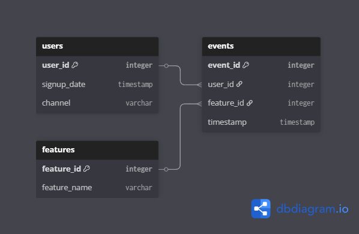
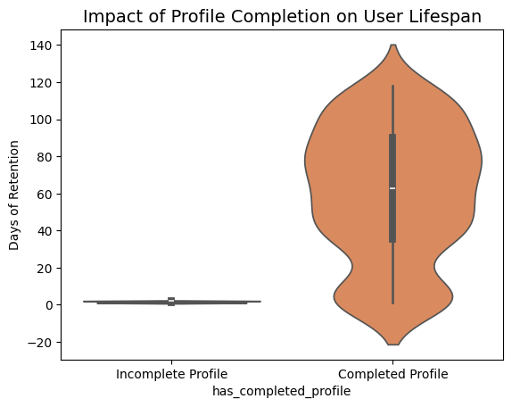

# SaaS Retention Engine & Behavioral Analytics 💻📊

<p align="center">
  
  
  
  
  
  
  
</p>

## 📈 High-Level Strategy & Insights
<p align="center">
   <a href="https://purring-sailboat-492.notion.site/SaaS-Retention-Engine-Behavioral-Analytics-02-09-2026-2e01d3119ed0803abe62e32ed450fe4e?source=copy_link">
     
   </a>
   <br>
   <em>Visit the full case study for business recommendations and the behavioral roadmap.</em>
 </p>

## 📊 Project Overview
This project develops a data-driven engine to identify the behavioral drivers of user loyalty in a SaaS environment. As a **Mathematics Student and Data Scientist Trainee**, I designed an end-to-end pipeline that simulates user behavior, processes event logs via PostgreSQL, and applies **Pearson Correlation** to validate the "Aha! Moment." The goal is to provide a scientific basis for product onboarding optimizations.

## 🏗️ Phase 0: Data Engineering & Pre-Processing

### 🧪 Behavioral Simulation (Synthetic Data)
To ensure a high-fidelity environment, I architected a simulation script using **NumPy** and **Python's datetime library** to generate 600 unique users and thousands of event logs:
* **Controlled Logic:** Programmed differentiated activity paths using a helper flag (`is_retained_type`) to create distinct distributions for "Retained" vs. "Churned" users, allowing for rigorous testing of statistical sensitivity.
* **Feature Catalog:** Defined a relational feature set including `login` (ID 1), `profile_completion` (ID 2), and `social_invite` (ID 3).
* **Temporal Manipulation:** Leveraged `timedelta` to simulate realistic event spacing over a 180-day window, ensuring timestamps reflected logical user journeys.
* **Standardization & Cleaning:** Converted all generated data into standardized ISO Datetime objects and performed a final sanitization step to remove simulation helper columns before database migration.

### 🏗️ Relational Architecture (Star Schema)
I transformed simulated raw data into a **Relational Star Schema** within PostgreSQL. This design decouples descriptive user dimensions from the transactional fact table (`events`), enabling efficient cohort processing.

<p align="center">
  
</p>

### ⚙️ Automated ETL Migration
I implemented an automated ingestion layer using **SQLAlchemy** to migrate data from the Python environment to a **PostgreSQL** instance, enforcing data types and relationships across the `users`, `features`, and `events` tables.

## 🛠️ Phase 1: The Retention Logic (Master SQL)
The core analytical engine resides in a robust SQL pipeline. I developed a **Common Table Expression (CTE)** to calculate the "Age Month" of each user, which serves as the foundation for the Retention Matrix:

```sql
WITH cohort_items AS (
    -- Step 1: Define the "Birth Month" for each user
    SELECT user_id, DATE_TRUNC('month', signup_date) AS cohort_month
    FROM users
),
user_activities AS (
    -- Step 2: Calculate the "Age Month" (distance from signup to event)
    SELECT e.user_id, c.cohort_month,
	      (EXTRACT(YEAR FROM e.timestamp) - EXTRACT(YEAR FROM c.cohort_month)) * 12 + 
        (EXTRACT(MONTH FROM e.timestamp) - EXTRACT(MONTH FROM c.cohort_month)) AS
        month_number
    FROM events e
    JOIN cohort_items c ON e.user_id = c.user_id
),
cohort_counts AS (
    -- Step 3: Aggregate unique active users per cohort and month
    SELECT cohort_month, month_number, COUNT(DISTINCT user_id) AS active_users
    FROM user_activities
    GROUP BY cohort_month, month_number
),
cohort_correlation AS (
		SELECT * 
		FROM cohort_counts
		ORDER BY cohort_month, month_number
)

SELECT *
FROM cohort_correlation;
```

## 🔬 Phase 2: Exploratory Data Analysis (EDA)

### 📈 Cohort Retention & Churn Velocity
* **Discovery:** The heatmap identifies a critical **"Retention Leak"** in **Month 1**.
* **Finding:** Retention stabilizes after the second month for users who engage early, suggesting that the first 30 days are the highest-leverage period for user intervention.

<p align="center">
  
</p>


### 🎯 The "Aha! Moment" Validation (Technical Hook)

> [!IMPORTANT]
> **Scientific Insight:** Using **SciPy**, I calculated a **Pearson Correlation of 0.7459** between `has_completed_profile` and `lifespan_days`. With a **P-Value of 1.28e-107**, we have mathematically proven that **Profile Completion (Feature ID 2)** is not just an event, but the primary predictor of long-term retention.

<p align="center">
  
</p>


### 🎻 Distribution Density
The **Violin Plot** analysis reveals that users in the **"Completed Profile"** group show a significantly higher density of active days (40-120 range) compared to the **"Incomplete Profile"** group, which typically churns within the first 10 days of the lifecycle.

---

## 🛠️ Tech Stack & Requirements
* **Core:** Python 3.13, SQL (PostgreSQL logic).
* **Libraries:** Pandas, NumPy, **SciPy (Statistics)**, SQLAlchemy, Seaborn, Matplotlib.
* **Environment:** Jupyter Notebooks.

## 🛠️ Setup & Quick Start
1. **Clone the repository**:  
   `git clone https://github.com/JesusAHB25/SaaS-Retention-Engine-Behavioral-Analytics.git`
2. **Install dependencies**:  
   `pip install -r requirements.txt`
3. **Configure your local PostgreSQL URL** in the notebook.
4. **Open SaaS Retention Engine & Behavioral Analysis.ipynb** and run the cells to replicate the pipeline.

## 📂 Repository Structure
```text
├── data/
│   └── 📄 Raw CSV files                         # Exported datasets (users, features, events.)
├── sql_queries/
│   └── 📄 database_logic.sql           # Phase 1: Cohort Retention Engine (SQL CTEs)
├── src/
│   ├── 📄 data_pipeline.py             # Modular ETL: Lifespan calculation & SciPy tests
│   └── 📄 visualizations.py            # Phase 2: Statistical plots (Heatmaps & Violin Plots)
├── notebooks/
│   ├── 📓 data_preprocessing.ipynb     # Phase 0: Synthetic simulation and SQL migration
│   └── 📓 SaaS Retention Engine.ipynb  # Full implementation (Engineering + EDA)
├── images/
│   └── 🖼️ ERD diagrams, Retention Heatmaps, and Violin plots
└── 📄 requirements.txt                 # Project dependencies (Pandas, SciPy, SQLAlchemy)
```

---
*Developed by **Jesús** | Mathematics Student & Data Scientist Trainee* 🤖🔵
